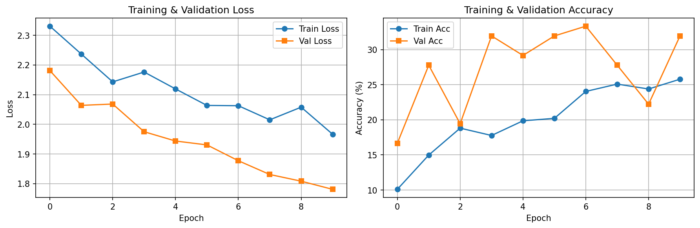
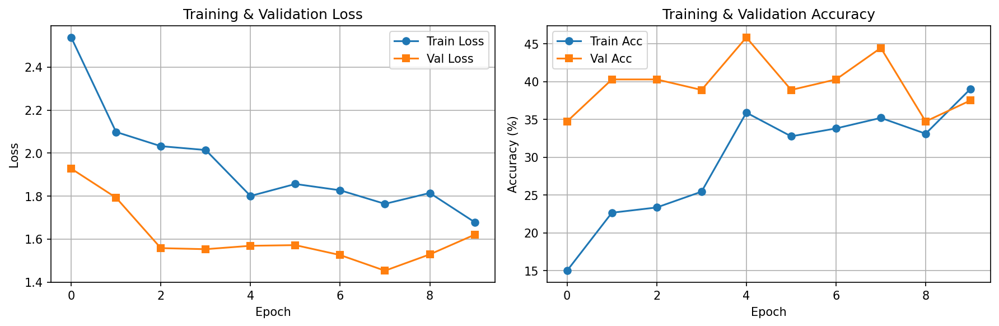
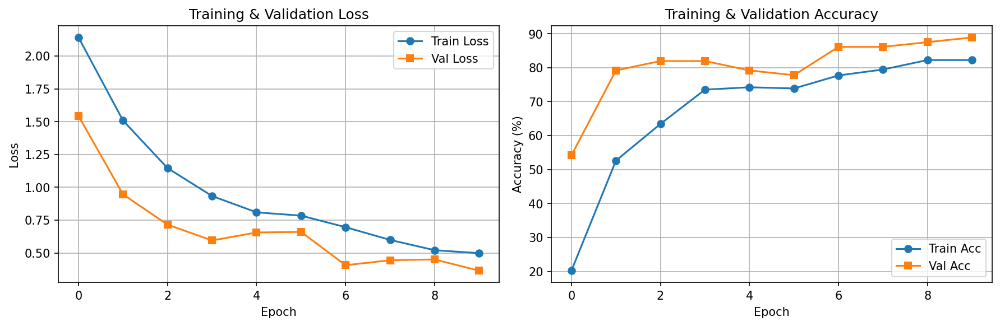
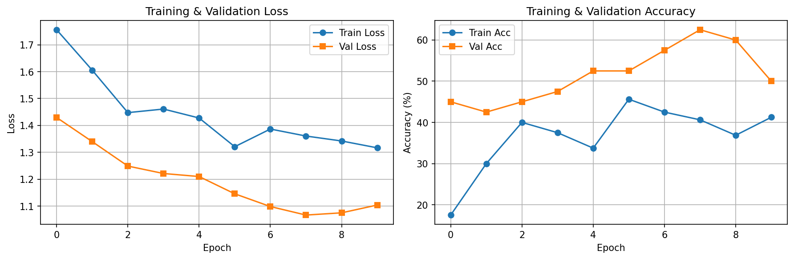
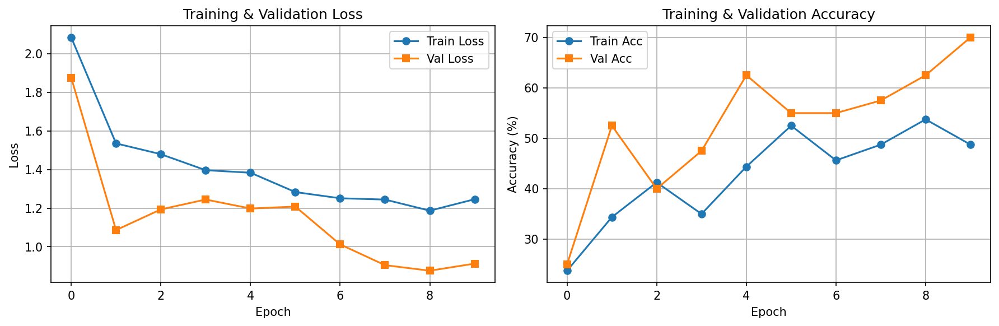
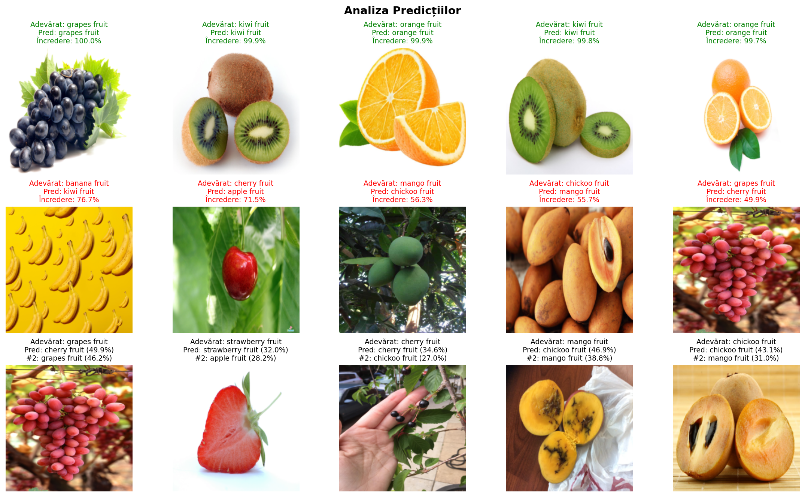

# ai-classification
# Raport Temă — Clasificator Inteligent de Fructe cu Explainable AI

**Student:** Aida Gabriela
**Data:** 21 Aprilie 2026
**Dataset:** Fruit Images — 9 clase, ~42 imagini/clasă (~378 total)

---

## Partea 1: Modificări de Bază

### 1.1 Extindere la 9 Clase de Fructe

Codul inițial folosea 5 clase (`SELECTED_CLASSES = [...]`). Am extins dataset-ul să includă **toate cele 9 clase** disponibile:

```python
# ÎNAINTE (5 clase):
SELECTED_CLASSES = ['apple fruit', 'banana fruit', 'cherry fruit', 'grapes fruit', 'orange fruit']

# DUPĂ (9 clase):
SELECTED_CLASSES = None  # None = toate clasele din folder
```

**Clasele incluse:** apple, banana, cherry, chickoo, grapes, kiwi, mango, orange, strawberry

**Impactul observat:** Trecerea de la 5 la 9 clase a crescut dificultatea clasificării semnificativ. MLP și CNN au pierdut acuratețe față de versiunea cu 5 clase, confirmând că modelele mai simple nu scalează bine cu numărul de clase pe dataset-uri mici.

---

### 1.2 Ajustare Hiperparametri

Au fost efectuate mai multe rulări cu configurații diferite, urmărite prin **MLflow** și **TensorBoard**.

**Configurația finală (cea mai bună):**

| Hiperparametru | Valoare |
|---|---|
| `BATCH_SIZE` | 16 |
| `LEARNING_RATE` | 0.001 |
| `EPOCHS` | 10 |
| `WEIGHT_DECAY` | 1e-4 |
| `DROPOUT_RATE` | 0.5 |
| `EARLY_STOPPING_PATIENCE` | 5 |
| `EARLY_STOPPING_MIN_DELTA` | 0.001 |

**Comparație rulări (urmărite în MLflow):**

| Rulare | Timestamp | Note | ResNeXt Val Acc |
|---|---|---|---|
| Run 1 | 121818 | Configurație inițială, 9 clase | ~62% MLP, ~70% CNN |
| Run 2 | 131512 | StratifiedShuffleSplit adăugat | ~32% MLP, ~46% CNN, **~89% ResNeXt** |
| Run 3+ | 135128–142151 | Experimente suplimentare CNN | variabil |

> **Observație:** Adăugarea `StratifiedShuffleSplit` în locul `random_split` a asigurat o distribuție echilibrată a claselor în setul de validare, îmbunătățind relevanța metricilor.

---

### 1.3 Data Augmentation Suplimentară

Au fost adăugate în `get_transforms('train')` transformările cerute, plus altele pentru robustețe:

```python
# Transformări adăugate față de codul inițial:
transforms.RandomGrayscale(p=0.1),          # 10% imagini devin gri
transforms.GaussianBlur(kernel_size=5, sigma=(0.1, 2.0)),  # Blur gaussian
transforms.RandomPerspective(distortion_scale=0.2, p=0.3), # Perspectivă aleatorie
transforms.ColorJitter(brightness=0.2, contrast=0.2,       # Variații de culoare
                       saturation=0.2, hue=0.1),
```

**Vizualizare înainte/după transformări:**


*Coloana 1: original | Coloana 2: train transform (cu augmentare) | Coloana 3: val transform (fără augmentare)*

**Efecte observate:** Augmentarea a ajutat mai ales ResNeXt să generalizeze. Pe dataset-uri mici (~42 imagini/clasă), augmentarea crește efectiv dimensiunea dataset-ului de antrenare și reduce overfitting-ul.

---

## Partea 2: Funcționalități Avansate

### 2.1 Occludere Artificială — RandomPixelRemoval

S-a implementat clasa custom `RandomPixelRemoval` care simulează fructe parțial acoperite:

```python
class RandomPixelRemoval:
    """
    Elimină aleatoriu o fracțiune din pixelii imaginii, setându-i la 0.
    Simulează ocluzia parțială (fruct ascuns parțial).
    """
    def __init__(self, probability=0.1):
        self.probability = probability  # 10% pixeli eliminați

    def __call__(self, tensor):
        # Creează mască: True = pixel păstrat, False = pixel eliminat
        mask = torch.rand_like(tensor) > self.probability
        return tensor * mask  # Pixelii mascați devin 0 (negru)
```

**Caracteristici cheie:**
- Se aplică **după** `transforms.ToTensor()` — lucrează pe tensor, nu pe imagine PIL
- `probability=0.1` = 10% din pixeli eliminați (configurabil prin `Config.OCCLUSION_PROB`)
- Forțează modelul să nu depindă de pixeli individuali → reprezentări mai robuste

**Unde este integrată:**
```python
# În get_transforms('train'), ultimul pas:
RandomPixelRemoval(probability=Config.OCCLUSION_PROB)
```

**Efect vizual:** Pixelii eliminați apar ca puncte negre distribuite aleatoriu pe imagine. La `p=0.1`, impactul vizual este minim dar efectul de regularizare este semnificativ.

---

### 2.2 Tracking Experimente cu MLflow + StratifiedShuffleSplit

S-au adus două îmbunătățiri majore în `load_data()`:

**a) StratifiedShuffleSplit** în locul `random_split`:
```python
# ÎNAINTE: split aleatoriu (poate dezechilibra clasele)
train_dataset, val_dataset = random_split(full_dataset, [train_size, val_size])

# DUPĂ: split stratificat (menține proporțiile claselor)
sss = StratifiedShuffleSplit(n_splits=1, test_size=val_size, random_state=42)
train_indices, val_indices = next(sss.split(indices, targets))
```

**b) Logging complet MLflow** — toți hiperparametrii și metricile sunt logați per epocă:
```python
mlflow.log_params({"batch_size": 16, "learning_rate": 0.001, ...})
mlflow.log_metrics({"val_acc": val_acc, "val_loss": val_loss}, step=epoch)
mlflow.log_artifact(checkpoint_path)   # Salvare model
mlflow.pytorch.log_model(model, "model")
```

**Comparare experimente:** `mlflow ui` → `http://localhost:5000`

---

## Rezultate Experimentale

### Acuratețe per Model (9 clase, run final — 131512)

| Model | Parametri | Val Accuracy | Val Loss | Train Accuracy | Stabilitate |
|---|---|---|---|---|---|
| **MLP** | ~77M | **~32%** | ~1.78 | ~26% | Scăzută |
| **CNN** | ~28M | **~46%** | ~1.45 | ~39% | Moderată |
| **ResNeXt** | ~25M | **~89%** | ~0.34 | ~83% | Excelentă |

> **Linie de bază (random guess):** 1/9 clase = **11.1%** — toate modelele depășesc semnificativ această valoare.

---

### Curbe de Antrenare — MLP



**Observații:**
- Val accuracy oscilează între 28–33% — MLP nu poate captura structura spațială a imaginilor
- Val loss scade consistent dar rămâne ridicat (~1.78)
- Antrenarea pe 9 clase cu imagini 224×224 aplatizate (150,528 features) este dificilă pentru o rețea fully-connected

---

### Curbe de Antrenare — CNN



**Observații:**
- Val accuracy atinge un vârf de ~46% la epoca 4, apoi oscilează
- Volatilitate mare — semn de overfitting pe dataset-ul mic
- CNN custom, antrenat de la zero, nu are suficiente date pentru 9 clase

---

### Curbe de Antrenare — ResNeXt (Transfer Learning)



**Observații:**
- Val accuracy pornește de la **~54%** chiar de la prima epocă — transfer learning oferă un avantaj imediat
- Convergență rapidă și stabilă, ajungând la **~89%**
- Val accuracy > Train accuracy la primele epoci = backbone-ul înghețat generalizează bine
- Loss scade de la 1.55 → 0.34 pe validare

---

### Comparație Rulare 1 vs Rulare 2

**Run 1 (121818) — configurație inițială:**



MLP atinge ~62% val accuracy în prima rulare datorită unui split mai favorabil (random_split fără stratificare). Volatilitatea rămâne mare.



CNN atinge ~70% val accuracy în prima rulare — posibil datorită unui split nereprezentativ. Cu StratifiedShuffleSplit (run 2), acuratețea reală este ~46%, mai corect evaluată.

> **Concluzie comparație:** `StratifiedShuffleSplit` oferă o evaluare mai corectă și reproductibilă față de `random_split`, mai ales pe dataset-uri mici cu distribuții neuniforme.

---

## Capturi de Ecran din Vizualizări

### Saliency Maps


**Interpretare:**
- **Coloana 1** — Imaginea originală cu eticheta reală
- **Coloana 2** — Heatmap saliency: roșu intens = regiuni importante pentru predicție
- **Coloana 3** — Overlay: heatmap suprapus pe imaginea originală

**Observații concrete din imagine:**
- **Strawberry (căpșună)**: modelul se concentrează pe suprafața roșie și textura semințelor
- **Orange (portocală)**: atenția cade pe conturul fructului și pe secțiunea tăiată
- **Mango**: regiunile cu culoare galbenă-portocalie sunt cele mai saliante
- **Chickoo**: modelul identifică textura specifică a coajei maronii
- Fundalul alb este ignorat în general — modelul a învățat să se concentreze pe fruct

**Cazul interesant — Mango prezis ca Chickoo:** saliency map-ul arată că modelul s-a concentrat pe coajă (similară ca textură), nu pe formă sau culoare. Aceasta explică confuzia dintre cele două clase.

---

### Analiza Predicțiilor



**Predicții corecte (rândul 1):**
- Grapes: 100% confidență
- Kiwi: 99.9%
- Orange: 99.9%
- Kiwi: 99.8%
- Orange: 99.7%

**Predicții greșite (rândul 2):**
- Banana prezisă ca Kiwi (76.1%) — posibil din cauza culorii galbene similare
- Cherry prezisă ca Apple (77.5%) — fructe rotunde cu culori similare
- Mango prezisă ca Chickoo (56.3%) — texturi asemănătoare ale cojii
- Chickoo prezisă ca Mango (55.7%) — confirmare confuzie bidirecțională mango↔chickoo
- Grapes prezisă ca Cherry (89.9%) — boabe rotunde, culori similare

**Cazuri borderline (rândul 3):** modele cu diferențe mici între primele 2 predicții, unde modelul este nesigur.

---

## Concluzii

| # | Concluzie |
|---|---|
| 1 | **ResNeXt (Transfer Learning)** este cel mai potrivit model pentru clasificarea de fructe pe dataset-uri mici — 89% acuratețe vs 46% CNN și 32% MLP |
| 2 | **Transfer learning** oferă avantaj imediat: la prima epocă ResNeXt atinge deja 54% față de ~28% CNN/MLP |
| 3 | **StratifiedShuffleSplit** produce evaluări mai corecte decât `random_split` simplu |
| 4 | **Confuzii frecvente:** mango↔chickoo (textură cojii similară), grapes↔cherry (boabe rotunde), banana↔kiwi (culoare galbenă) |
| 5 | **Saliency Maps** confirmă că modelul a învățat caracteristici relevante (forma/textura fructului), nu artefacte sau fundal |

---

*Experimente urmărite în MLflow (`mlruns/`) și TensorBoard (`runs/fruit_classifier/`). Toate vizualizările sunt în `visualizations/`.*
